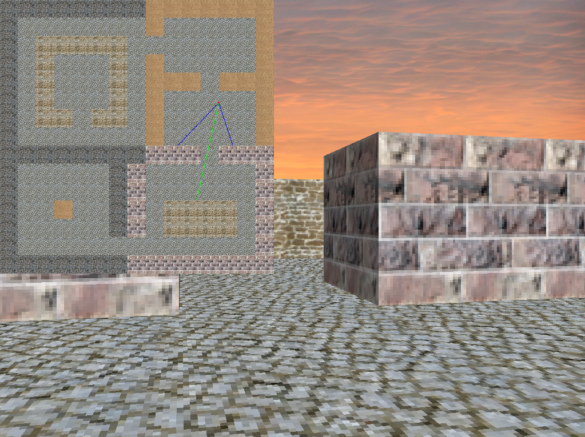
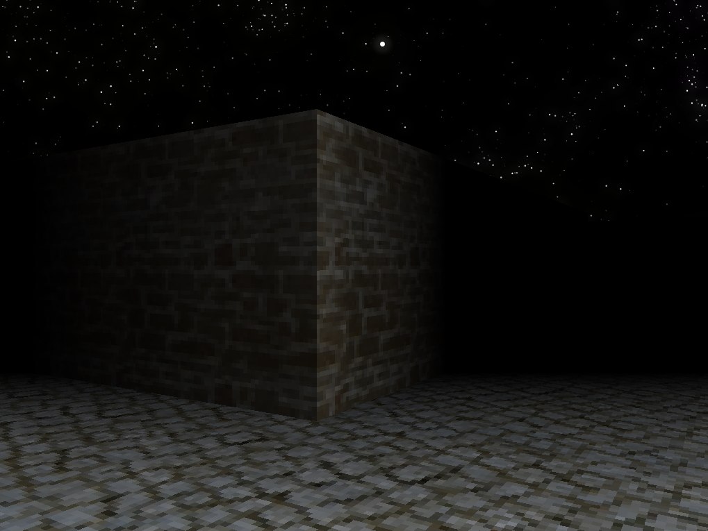

# Raycaster engine


[Live demo](https://balintkissdev.github.io/raycaster-engine) | [Windows 64-bit download](https://github.com/balintkissdev/raycaster-engine/releases/download/0.0.5/Raycaster-0.0.5-win64.zip) | [Linux 64-bit download](https://github.com/balintkissdev/raycaster-engine/releases/download/0.0.5/Raycaster-0.0.5-linux-x86_64.AppImage)

My take on making a raycasting pseudo-3D engine in C++, also with my own tiny template linear algebra types. One of the goals was to make raycasting computation equations more explicit and readable. Made first back in 2016 and adding code since to it.





## Features

- `Up/Down` to move and `Left/Right` to turn around
- `WASD` to move and strafe
- `M` to toggle mini-map
- `N` to toggle "Night Mode" and display darkness and lighting effect

## Requirements

- C++17-standard compatible C++ compiler
- CMake 3.16 or newer

That's all. The dependencies are automatically downloaded by [Hunter](https://github.com/ruslo/hunter/).

## Build

```bash
mkdir build
cd build
cmake ..
cmake --build . --config Release
```

For cross-compilation, you can use one of the CMake toolchain files.

`TOOLCHAIN=cmake/toolchain/x86_64-w64-mingw32.cmake cmake ..`

### Emscripten support

This project can be built with Emscripten in order to be embedded in HTML. After you
[set up the Emscripten environment](https://emscripten.org/docs/getting_started/downloads.html),
issue these commands:

```bash
mkdir build
cd build
# Workarounds required for Emscripten and Hunter to work together on a local machine.
emcmake cmake \
  -DCMAKE_C_ABI_COMPILED=ON \
  -DCMAKE_CXX_ABI_COMPILED=ON \
  -DCMAKE_CROSSCOMPILING=ON \
  ..
emcmake cmake --build . --config Release
```

## References:

- http://permadi.com/1996/05/ray-casting-tutorial-table-of-contents
- http://lodev.org/cgtutor/raycasting.html
- http://www.instructables.com/id/Making-a-Basic-3D-Engine-in-Java
- [Code-It-Yourself! First Person Shooter (Quick and Simple C++)](https://www.youtube.com/watch?v=xW8skO7MFYw) - by OneLoneCoder (javidx9)
  - [Upgraded! First Person Shooter at Command Prompt (C++)](https://www.youtube.com/watch?v=HEb2akswCcw)
  - [Super Fast Ray Casting in Tiled Worlds using DDA](https://www.youtube.com/watch?v=NbSee-XM7WA)
  - [Introducing RayCastWorld](https://www.youtube.com/watch?v=Vij_obgv9h4)
- Free sky texture is from http://www.texturex.com
- Free night sky texture is from https://opengameart.org/content/night-sky-stars-and-galaxies
- Free wall textures are from https://opengameart.org/content/wall-grass-rock-stone-wood-and-dirt-480
